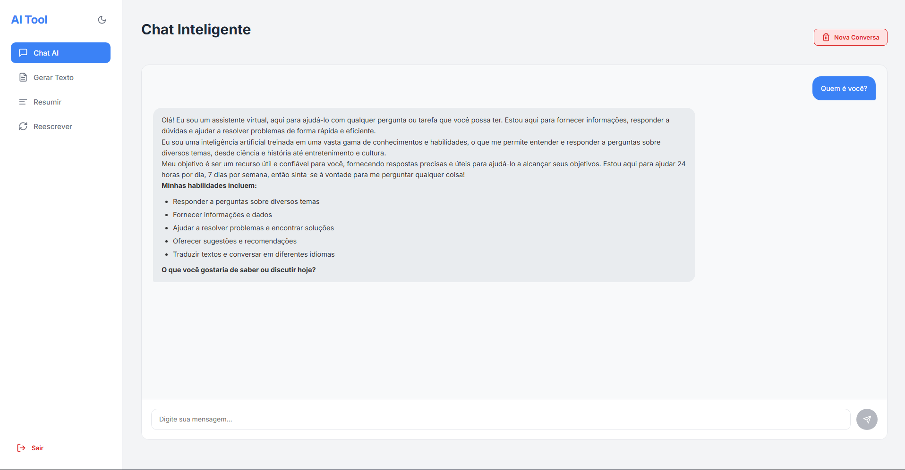
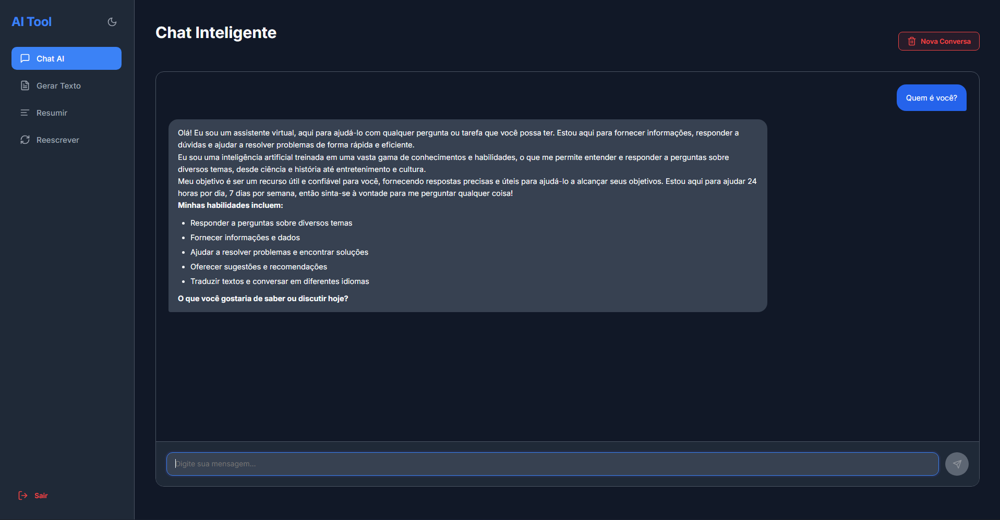
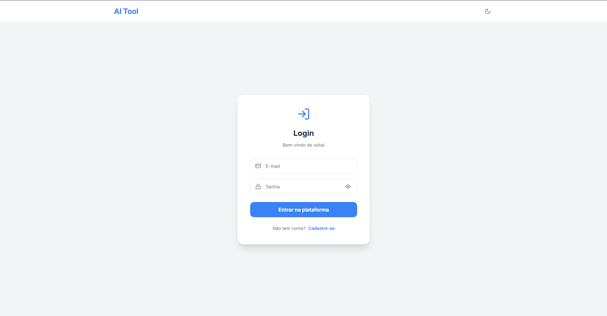

# 🤖 AI Tool - Inteligência Artificial Multifuncional

Uma plataforma moderna desenvolvida com **React**, **Firebase** e **Groq Cloud API (Llama 3)** para processamento de textos em tempo real. Este projeto oferece ferramentas de chat, resumo, geração de conteúdo e reescrita, tudo em uma interface otimizada com suporte a Dark Mode.

## 🚀 Funcionalidades

- **💬 Chat Inteligente:** Conversa contextual com a IA Llama 3.3.
- **📝 Ferramentas de Texto:**
  - **Gerar:** Crie textos do zero a partir de prompts.
  - **Resumir:** Extraia o essencial de textos longos.
  - **Reescrever:** Melhore a fluidez ou mude o tom de um texto.
- **🌓 Dark Mode:** Interface adaptável à preferência do usuário.
- **🔒 Autenticação:** Sistema de login e cadastro seguro via Firebase Auth.
- **💾 Histórico:** Mensagens do chat salvas automaticamente no Firestore.
- **📋 Copiar Texto Limpo:** Função exclusiva para copiar o resultado da IA removendo formatação Markdown.

## 🛠️ Tecnologias Utilizadas

- **Frontend:** [React.js](https://reactjs.org/)
- **Estilização:** CSS3 (Variáveis nativas para temas)
- **Ícones:** [Lucide-React](https://lucide.dev/)
- **Backend/Auth:** [Firebase](https://firebase.google.com/)
- **Cérebro (IA):** [Groq Cloud SDK](https://groq.com/) (Llama 3 Models)
- **Notificações:** [React Hot Toast](https://react-hot-toast.com/)

## 📸 Screenshots

  
  
  

## 🔧 Instalação e Configuração

1. **Clone o repositório:**

    git clone [https://github.com/murilo-estudos/crud-pro.git](https://github.com/murilo-estudos/crud-pro.git)

2. **Instale as dependências:**

    npm install

3. **Configure o Firebase:**
Crie um arquivo *.env* na raiz do projeto e adicione suas credenciais:

    REACT_APP_FIREBASE_API_KEY=sua_key
    REACT_APP_FIREBASE_AUTH_DOMAIN=seu_domain
    REACT_APP_GROQ_API_KEY=sua_chave_groq
    ...

4. **Inicie o servidor local:**

    npm start

📄 Licença
Este projeto está sob a licença MIT. Veja o arquivo LICENSE para mais detalhes.

Desenvolvido por Murilo Borges 🚀